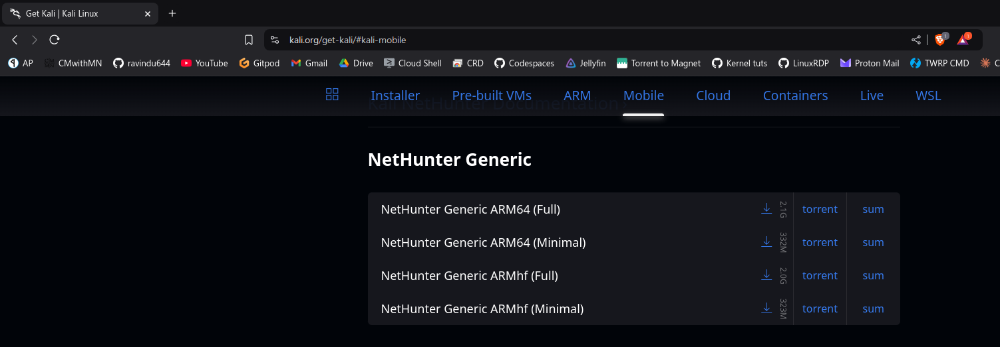
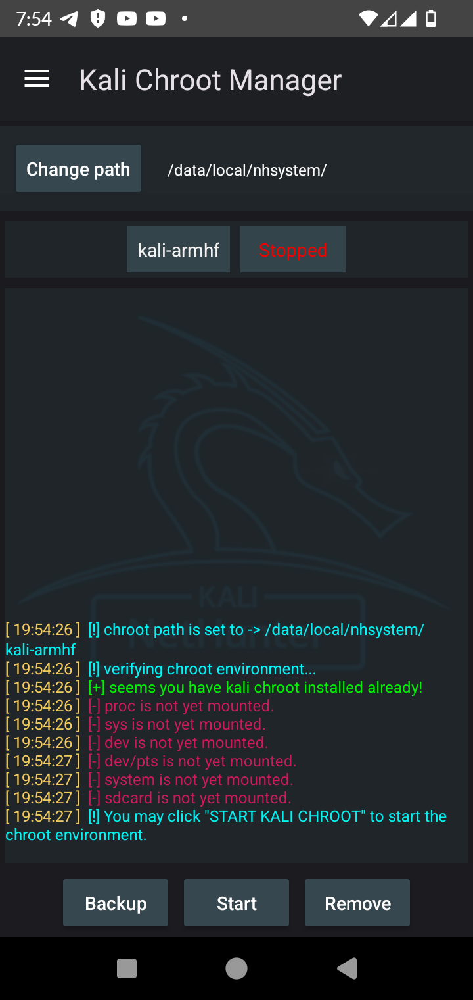
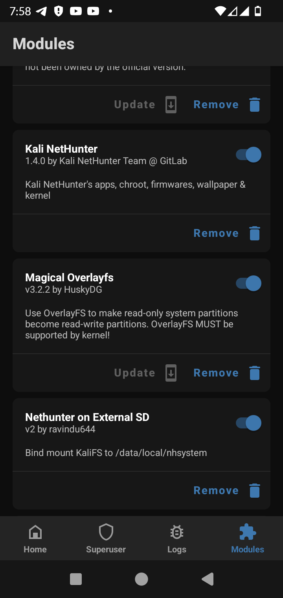

# Installing Kali Nethunter Full on Galaxy A01
## A Beginner's Guide for Low Storage Devices

### Prerequisites
- Galaxy A01 with [Nethunter OS Installed](https://t.me/SamsungTweaks/555?single)
- External SD card (at least 16GB)
- Sufficient battery charge (at least 50%)

### Required Files
1. `NetHunter Generic ARMhf (Full)`
2. `NetHunter Generic ARMhf (Minimal)`

Both packages can be downloaded from the [official Nethunter Downloads page](https://www.kali.org/get-kali/#kali-mobile).

### Step-by-Step Installation Guide

#### Phase 1: Initial Setup
1. Download both the minimal and full packages from the official Nethunter Downloads website.

   

   **Recommended packages for Galaxy A01:**
   - NetHunter Generic ARMhf (Full)
   - NetHunter Generic ARMhf (Minimal)

2. Install the minimal package first:
   - Open Magisk Manager
   - Install the `NetHunter Generic ARMhf (Minimal)` zip file
   - Reboot your device

#### Phase 2: Preparing for Full Installation
3. After reboot, open the Nethunter app:
   - Grant root permissions when prompted
   - Navigate to "Kali Chroot Manager"
   - Press the "Stop" button

   

4. Remove the existing minimal installation:
   - Press the "Remove" button
   - Wait for the process to complete

5. Format your external SD card:
   - Format it to ext4 file system
   - You can use [TWRP](https://t.me/ravindu644/608) or Mini Tool Partition Wizard
   - **Important:** Ensure your SD card has only one partition

6. Flash the external SD card setup:
   - Install [kali-external-sd_v2.zip](https://github.com/ravindu644/Simple-Android-Guides/raw/refs/heads/nethunter-externalsd/res/kali-external-sd_v2.zip)
   - Reboot your device

   

#### Phase 3: Full Installation
7. Extract the full package:
   - Locate `kalifs-full-armhf.tar.xz` from the full package
   - Extract it to your device's internal storage

8. Open a terminal and run these commands in order:
   ```bash
   busybox tar -xJf /sdcard/kalifs-full-armhf.tar.xz -C /data/local/nhsystem --exclude "kali-armhf/dev"
   
   ln -sf /data/local/nhsystem/kali-armhf /data/local/nhsystem/kalifs
   
   mkdir -p -m 0755 /data/local/nhsystem/kali-armhf/dev
   ```

9. Reboot your device to complete the installation.

### Important Notes
- Command syntax might vary depending on your specific file names. Adjust commands accordingly.

### Troubleshooting
If you encounter any issues:
- Double-check that all files were downloaded completely
- If your NetHunter Minimal installation fails in Magisk Manager due to a mismatch in screen resolution, you need to manually edit the installation script to prevent it from aborting the process when the screen resolution is not found. Alternatively, you can report the issue to the NetHunter maintainers on GitLab.
- Ensure your SD card is properly formatted to ext4 format and have only 1 partition
- Make sure you followed the steps in the correct order

### Success Verification
After rebooting, open the Nethunter app to verify that the full installation is working properly. You should have access to all Kali Linux tools and features.